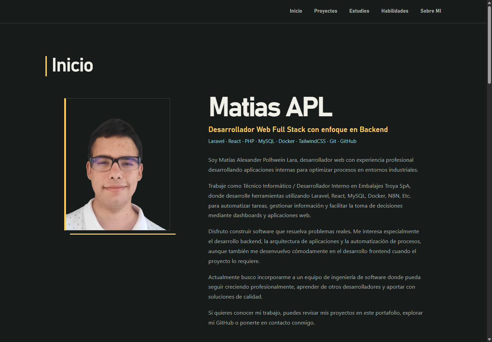
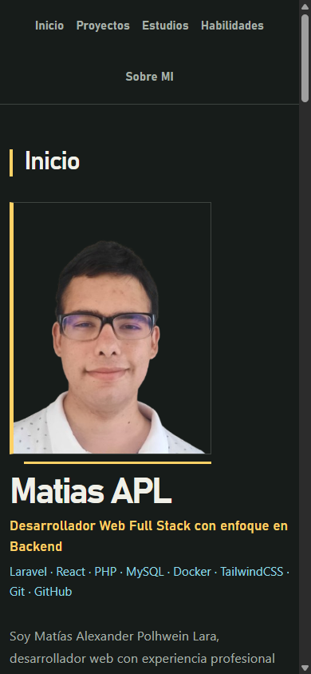

# Portafolio de Matías APL

Portafolio personal de **Matías Alexander Polhwein Lara**, desarrollador web Full Stack con enfoque en Backend. Presenta proyectos, experiencia, estudios y habilidades, con énfasis en aplicaciones web para procesos industriales.

🌐 **Sitio publicado:** [mapl.dev](https://mapl.dev)

## Vista previa

| Escritorio | Móvil |
| --- | --- |
|  |  |

## Secciones

- **Inicio:** perfil profesional y presentación.
- **Proyectos:** proyectos web y herramientas para gestión y producción.
- **Estudios:** formación académica.
- **Habilidades:** tecnologías y herramientas agrupadas por categoría.
- **Sobre mí:** enlaces de contacto y Curriculum Vitae.

## Tecnologías

- React 19 y TypeScript
- Vite con `@vitejs/plugin-react-swc`
- Tailwind CSS 4 y Bootstrap 5
- React Icons

## Desarrollo local

Requisitos: Node.js `^20.19.0` o `>=22.12.0` y npm.

```bash
npm install
npm run dev
```

Vite mostrará en la terminal la dirección local para abrir el sitio.

### Comandos disponibles

| Comando | Descripción |
| --- | --- |
| `npm run dev` | Inicia el servidor de desarrollo. |
| `npm run lint` | Ejecuta ESLint. |
| `npm run build` | Comprueba TypeScript y genera la versión de producción en `dist/`. |
| `npm run preview` | Sirve localmente la versión generada. |

## Estructura principal

```text
src/
├── Pages/Contenido.tsx       # composición de las secciones
├── components/               # navegación y secciones del portafolio
├── App.tsx
└── index.css                 # estilos globales
public/                       # imágenes y recursos estáticos
docs/images/                  # capturas de vista previa para este README
```

## OpenCode y Playwright MCP (opcional)

El repositorio incluye una configuración de OpenCode para pruebas visuales con Chromium administrado por Playwright. Si vas a usar este MCP, instala el navegador una vez:

```bash
npx -y @playwright/mcp@0.0.83 install-browser chromium
```

La configuración localiza el servidor como `playwright` al iniciar OpenCode en este repositorio.
